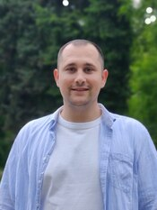

# Yabanzhy Dmytro
---
## My contact info

- Adress - **Ukraine, Odesa**
- e-mail - **[yabanzhy.dmytro@gmail.com](yabanzhy.dmytro@gmail.com)**
- GitHub - **[ya-dmitro](https://github.com/ya-dmitro)**
- LinkedIn - **[Dmytro Yabanzhy](https://www.linkedin.com/in/dmytro-yabanzhy-a0b08b147/)**
- telegram - **[Bro_dy](https://t.me/Bro_dy)**
- discord - **brody_0511**


## Summary

Communicable. Active. Reasonable.

My goal is to get new knowledge and a new profession


## Skills

- **HTML**
- **CSS**
- **Module Bundlers: Gulp**
- **Figma(for web development)**
- **Editors:  VSCode**

## Code Example

```
function sum(a, b) {  
  return a + b;  
}  

let result = sum(1, 2);  
alert( result );
```


## Education

**Odesa National Economic University - Accounting and Audit**

**Courses:**
- hillel IT school ([certificate](https://certificate.ithillel.ua/view/40442905))

- RS Schools Course «JavaScript/Front-end. Stage 0» (in progress)


## Languages:

- English [Pre-Intermediate (CEFR A2+)](https://test.str.by/mod/quiz/view.php?id=1176)
- Ukrainian
- Romanian
- Russian 